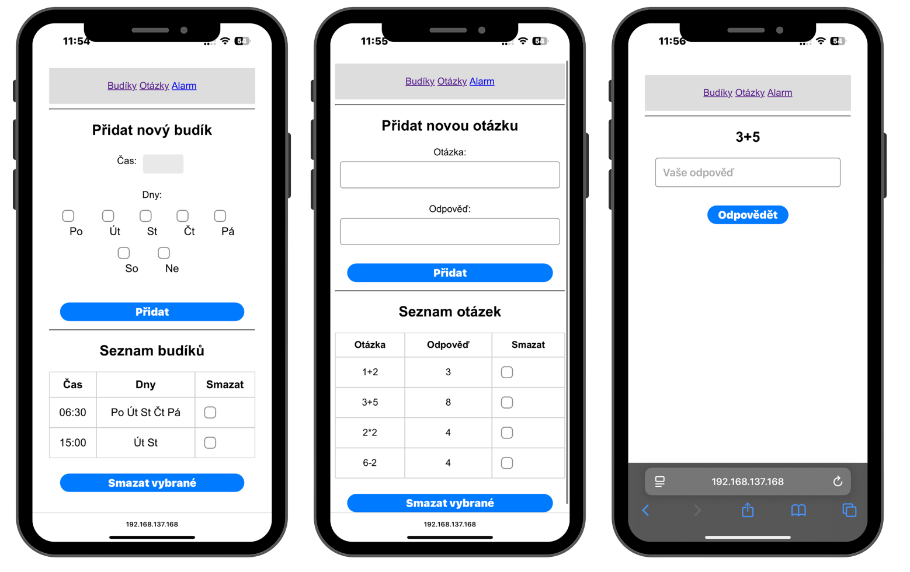
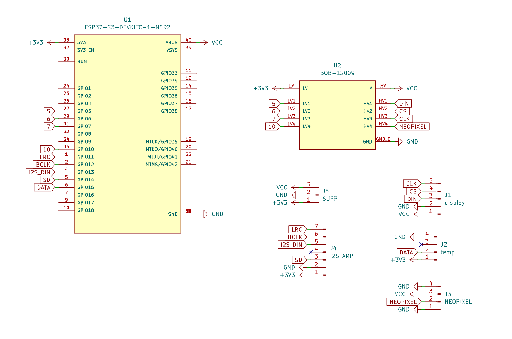
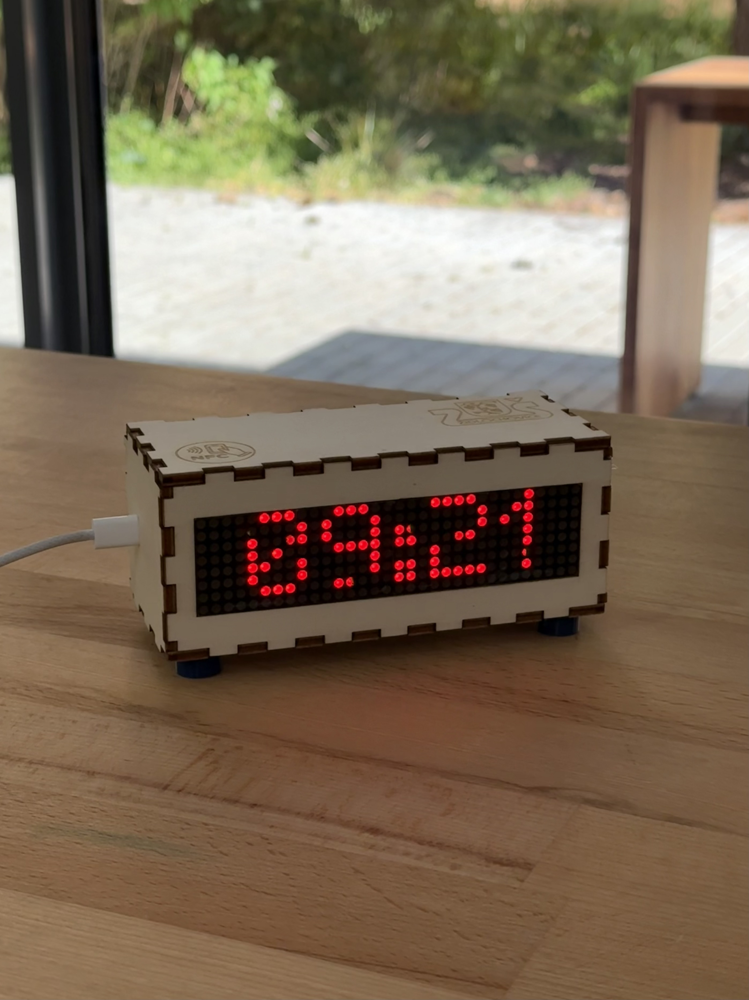

# ⏰ Chytrý budIQ s unikátním vypínáním
---
Tento projekt vznikl v rámci soutěže pořádané ve spolupráci se ZŠ Židlochovice a FabLabem Brno.  
Naším cílem soutěže bylo vytvořit moderní a originální zařízení propojující 3D tisk, gravírování, návrh vlastní elektroniky a programování.

Naším výsledkem je chytrý budík s unikátním způsobem vypínání pomocí otázek.

## Základní popis

Budík se po zapojení automaticky připojí k přednastavené Wi-Fi síti a na LED displeji zobrazuje aktuální čas, který si pravidelně z internetu synchronizuje. Ovládání probíhá přes webovou aplikaci běžící lokálně přímo na mikrokontroléru **ESP32-S3**. Není potřeba instalovat žádnou externí aplikaci do telefonu.

Uživatel si v aplikaci nastaví:
- čas buzení
- dny v týdnu
- otázky (například matematické nebo znalostní)

Budík nelze vypnout pouhým stisknutím tlačítka, alarm se zastaví až po správné odpovědi na zvolenou otázku.

Tento princip aktivního vypínání pomáhá překonat ranní ospalost a snižuje riziko opětovného usnutí.

## Webová aplikace

Webová aplikace běží lokálně na zařízení. Stačí být připojen ke stejné domácí Wi-Fi síti. Wi-Fi síť se přednastavuje v programu nahraném na ESP32-S3.

 

### Aplikace umožňuje:

-  Přidat nový budík (čas + dny)
-  Spravovat seznam budíků a otázek
-  Vytvářet vlastní otázky a odpovědi
-  Odpovídat na otázku při buzení

Přístup do aplikace je rychlý:
- přiložením telefonu k NFC tagu na budíku
- nebo přes uloženou webovou zkratku v telefonu

Aplikace je navržena tak, aby byla snadno přístupná, rozšiřitelná a umožňovala budoucí aktualizace.

##  Použité technologie

- ESP32-S3 Pico
- 8×32 LED displej
- Vlastní návrh a výroba PCB
- NFC technologie
- Gravírovaný a 3D tištěný kryt
- Lokální webová aplikace běžící na ESP32

##  Proč je náš budík jiný?

| Náš budík | Běžné budíky |
|-----------|--------------|
| Ruční výroba | Sériová výroba |
| Vypínání pomocí otázek | Jednoduché tlačítko |
| Aktivní probuzení | Minimální interakce |

##  Rozpočet a srovnání

Kvůli pravidlům soutěže jsme museli použít výhradně součástky dostupné skladem v České republice. První verze budíku tedy vznikla z komponent zakoupených u českých dodavatelů.

Po skončení soutěže jsme postavili ještě jeden kus budíku, tentokrát ze součástek objednaných z AliExpressu.  
Cílem bylo porovnat cenový rozdíl mezi nákupem v ČR a zahraničí.

Výsledek:
- při nákupu součástek z AliExpressu byl nákup levnější
- je však nutné počítat s delší dodací dobou (pro nás to bylo 9 dní)
- a možnými riziky kompatibility či kvality

Podrobné srovnání je uvedeno v souboru:

##  Možnost dalšího vývoje

Po skončení soutěže se cesty našeho týmu postupně rozdělily, projekt však pro nás nekončí. Ve volném čase bychom se mu chtěli i nadále věnovat a rozvíjet jej.

Plánovaná vylepšení:
- vestavěná nabíjecí baterie (funkčnost při výpadku proudu)
- nové typy otázek
- rozšíření funkcí webové aplikace
- možnost jednodušších aktualizací systému

Projekt pro nás představuje základ pro další vývoj a experimentování.

##  Odkaz na soutěž

https://www.soutezsfablabem.cz/predesle-rocniky/jaro-2025

## Poděkování

Děkujeme všem, kteří nás v projektu podpořili, zejména vedení školy a týmu FabLab Brno za možnost účasti v soutěži.

## Autoři

Tým žáků ZŠ Židlochovice (2025):

- Jiří Vítek  
- Jonáš Krejčiřík (kaso-0)  
- Matěj Marek  
- Patrik Hoff  

**Mentor:** Jiří Vítek  
spoluprace.jirivitek@gmail.com

Tento projekt není dovoleno dále upravovat, kopírovat ani jinak využívat bez předchozí domluvy s autory. Sdílení odkazu na repozitář je povoleno.
